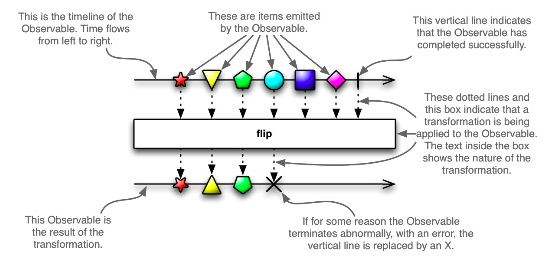
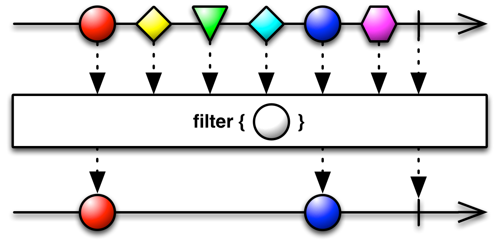
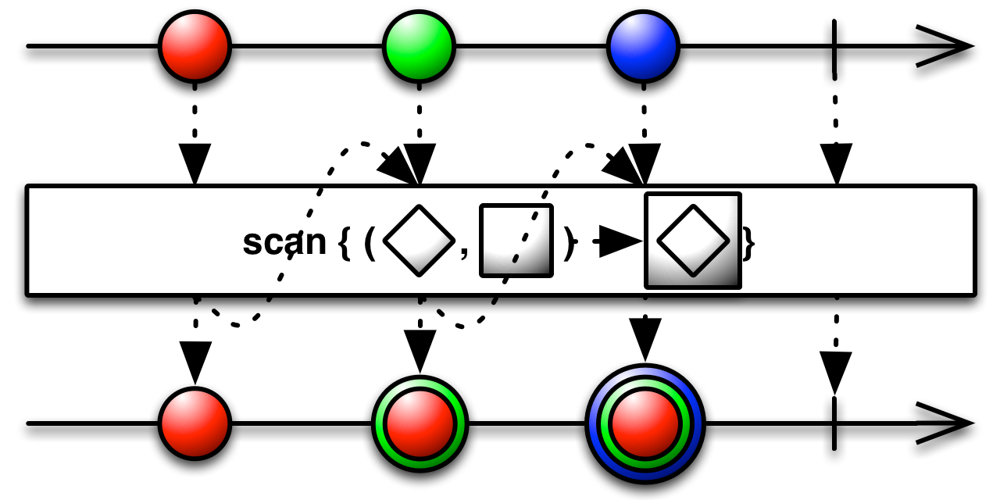
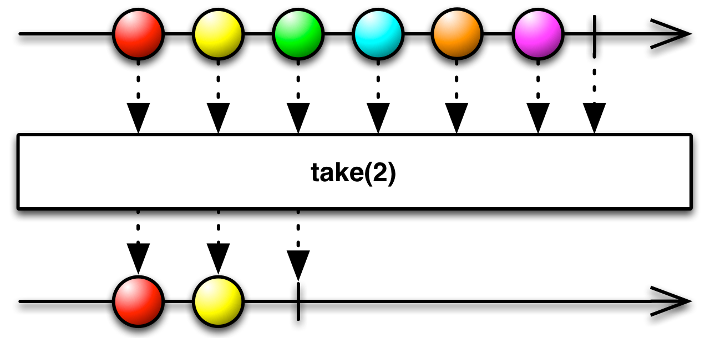
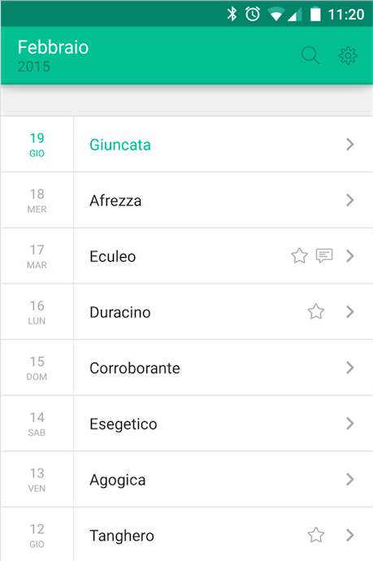

#RxJava and RxAndroid

---

#Reactive Programming
##a.k.a. asynchronous data streams programming
- **stream of asynchronous events**, that can be observed
- streams can be used as an inputs to other streams (*functional* part)
- wide range of **operators** on streams, graphically represented with [marble diagrams](http://rxmarbles.com).

---

#Marble diagrams


---

#Streams (a.k.a. Observables)
- *sequence of ongoing event ordered in time*
- 3 type of events:
  - **values**
  - **error**
  - **completed**

- when **subscribing** to a stream, some functions can be scheduled to be executed when a new event is received, asynchronously

---

#Operators

- streams are **immutable**
- operators on a stream return a **new stream** based on the first one, without changing its signals

---

#RxJava

---

#RxJava basics
- **Observable**, entity emitting any number of signals (including zero), then terminating either by successfully completing, or due to an error
- **Subscriber**, entity consuming signals

Just like [standard observer pattern](http://en.wikipedia.org/wiki/Observer_pattern), except that often Observables don't start emitting signal until some subscriber starts observing:

- a *cold Observable* only emits signals **when it has a subscriber**
- a *hot Observable* emits signals **all the time**

---
#Hello, world!

- Observable with *just* one value

```java
Observable<String> myObservable = Observable.just("Hello, world!");
```

- `Observable.subscribe()` can handle one, two or three `Action` parameters (onNext(), onError(), and onComplete())

```java
myObservable.subscribe(onNextAction, onErrorAction, onCompleteAction);
```

- With Java 8 **lambdas**

```java
Observable.just("Hello, world!").subscribe(s -> System.out.println(s));
```

---

#Creating Observables
- `just( )` — convert an object or several objects into an Observable that emits that object or those objects
- `from( )` — convert an Iterable, a Future, or an Array into an Observable
- `empty( )`— create an Observable that emits nothing and then completes
- `error( )` — create an Observable that emits nothing and then signals an error

---

- `never( )` — create an Observable that emits nothing at all
- `create( )` — create an Observable from scratch by means of a function
- `defer( )` — do not create the Observable until a Subscriber subscribes; create a fresh Observable on each subscription
- ...

---

#Operators

- allows doing **anything** to the stream of data
- allows the setup of complex logic using nothing but **chains of simple operators**
- promote **encapsulation**

---

Example

```java
// Returns a List of website URLs based on a text search
Observable<List<String>> query(String text);

// Returns the title of a website, or null if 404
Observable<String> getTitle(String URL);

query("Hello, world!")                    // -> Observable<List<String>>
  .flatMap(urls -> Observable.from(urls)) // -> Observable<String>
  .flatMap(url -> getTitle(url))          // -> Observable<String>
  .filter(title -> title != null)
  .doOnNext(title -> saveTitle(title))    // extra behavior
  .map(title -> new Pair<Integer, String>(0, title)) // -> Observable<Pair<Integer, String>>
  .scan((sum, item) -> new Pair<Integer, Word>(sum.first + 1, item.second))
  .take(5)
  .subscribe(indexItemPair ->
      System.out.println("Pos: " + indexItemPair.first + ": title:" + indexItemPair.second ));
```

---

#Map


---

#FlatMap


---

#Filter



---
#Scan



---
#Take



---

#Error Handling

```java
Observable.just("Hello, world!")
  .map(s -> potentialException(s))
  .map(s -> anotherPotentialException(s))
  .subscribe(new Subscriber<String>() {
      @Override
      public void onNext(String s) { System.out.println(s); }

      @Override
      public void onCompleted() { System.out.println("Completed!"); }

      @Override
      public void onError(Throwable e) { System.out.println("Ouch!"); }
});
```

Every Observable ends with either a single call to `onCompleted()` **or** `onError()`.

---

#Error Handling

- `onError()` is called if an `Exception` is thrown **at any time**
- the operators don't have to handle exceptions
- exceptions are **propagated** to the `Subscriber`, which has to manage all the error handling

---

#Schedulers

allows to specify **in which thread**:

- an `Observable` has to run, with `subscribeOn( )`
- a `Subscriber` has to run, with `observeOn( )`
- `subscribeOn( )` and `observeOn( )` **are operators**, just like others

---

#Schedulers
  - `immediate( )`, that executes work **immediately** on the current thread
  - `newThread( )`, that creates a **new Thread** for each job
  - `computation( )`, that can be used for **event-loops**, processing callbacks and other computational work
  - `io( )`, that is intended for **IO-bound** work, based on an Executor thread-pool that will grow as needed
  - ...

---
#Example

```java

myObservableServices.retrieveImage(url)
  .subscribeOn(Schedulers.io())
  .observeOn(Schedulers.computation())
  .subscribe(bitmap -> processImage(bitmap));

```

---

#Subscriptions

- abstraction that represent the **link** between an `Observable` and a `Subscriber`
- `unsubscribe( )` can be used to *stop* the chain, **terminating wherever it is currently executing code**

```java
Subscription subscription = Observable.just("Hello, World!")
.subscribe(s -> System.out.println(s));

   ...

subscription.unsubscribe();
```

---

#CompositeSubscription algebra

- `add(Subscription s)`, **adds a new Subscription** to the CompositeSubscription; if the this is unsubscribed, will explicitly unsubscribing the new Subscription as well
- `remove(Subscription s)`, **removes a Subscription** from the CompositeSubscription, and unsubscribes the Subscription
- `unsubscribe()`, unsubscribes to **all** subscriptions in the CompositeSubscription

**NB**: *unsubscribing inner subscriptions has no effect on the container*

---

#RxAndroid

---

#Android schedulers

`AndroidSchedulers` package provides schedulers for *Android threading system*.

```java
retrofitService.getImage(url)
.subscribeOn(Schedulers.io())
.observeOn(AndroidSchedulers.mainThread())
.subscribe(bitmap -> myImageView.setImageBitmap(bitmap));
```

- `AndroidSchedulers.mainThread( )`, that will execute an action on the main **Android UI thread**
- `AndroidSchedulers.handlerThread(Handler handler)`, that **uses the provided Handler** to execute an action


---

#ViewObservable
Add some bindings for android `View`s.

- `clicks( )`, that emits a new item each time a `View` is **clicked**
- `text( )`, that emits a new item each time a `TextView`'s **text content** is changed
- `input( )`, same as above, for `CompoundButton`s
- `itemClicks( )`, same as above, for `AdapterView`s

---

#AndroidObservable
Even more facilities to abstract Android lifecycle management away

##`AndroidObservable.bindActivity( )` and `AndroidObservable.bindFragment( )`
- *automagically* use `AndroidSchedulers.mainThread()` for **observing**
- will **stop emitting signals** when activity/framgment did **finish**

---
#AndroidObservable, an example

```java
AndroidObservable.bindActivity(this, myService.getImage(url))
  .subscribeOn(Schedulers.io())
  .subscribe(bitmap -> myImageView.setImageBitmap(bitmap);
```

---

#AndroidObservable

##`AndroidObservable.fromBroadcast()`
- offers an abstraction over `BroadcastReceiver`, to create a new `Observable`

```java
IntentFilter filter = new IntentFilter(ConnectivityManager.CONNECTIVITY_ACTION);
AndroidObservable.fromBroadcast(context, filter)
.subscribe(intent -> handleConnectivityChange(intent));
```

---

#RxJava and RxAndroid, in action

---

#Network calls with Retrofit lib

- APIs that allows to perform **REST calls** that returns an `Observable`.
- Easy to combine multiple calls into one.

```java
@GET("/user/{id}/photo")
Observable<Photo> getUserPhoto(@Path("id") int id);

@GET("/photo/{id}/photometadata")
Observable<PhotoMetadata> getPhotoMetadata(@Path("id") int id);

Observable.zip(
  service.getUserPhoto(id),
  service.getPhotoMetadata(id),
  (photo, metadata) -> createPhotoWithData(photo, metadata))
  .subscribe(photoWithData -> showPhoto(photoWithData));


```

---

#Lifecycle

##Continuing a Subscription during a configuration change (e.g. rotation)

- solved by **caching** in RxJava

```java
// caching a request, so it only happens once,
// the request must be stored outside the lifecycle (e.g. a singleton..)
Observable<Photo> request = service.getUserPhoto(id).cache();

// ...When the activity in running...
Subscription sub = request.subscribe(photo -> handleUserPhoto(photo));

// ...When the Activity is being recreated...
sub.unsubscribe();

// ...Once the Activity is recreated, reusing the same cached request
request.subscribe(photo -> handleUserPhoto(photo));
```

---

#Lifecycle

##Subscribe and unsubscribe to Observable in **accordance with the Activity/Fragment lifecycle**
- use of `CompositeSubscription` helps keeping the **code clean**

```java
private CompositeSubscription mCompositeSubscription = new CompositeSubscription();

private void doSomething() {
  mCompositeSubscription.add(...); mCompositeSubscription.add(...);

}
@Override
protected void onDestroy() {
  super.onDestroy();
  mCompositeSubscription.unsubscribe();
}
```

---

#Lambda expression with Retrolambda

**Backport of Java 8** lambda expressions to Java 7, 6 and 5!

- save us from insanity
- only lambda expressions, not Java 8 APIs
- From the repo: *May break if a future JDK 8 build stops generating a new class for each invokedynamic call. Retrolambda works so that it captures the bytecode that java.lang.invoke.LambdaMetafactory generates dynamically, so optimizations to that mechanism may break Retrolambda.*

---

#A concrete example
##Paroloni Android app




---
#An approach

- dumb `Fragments` (observe and update)
- service all exposed as `Observable<T>`
- operators *doing the magic*
- reactive components (adapters..)

---

#REST API

```java

public interface ParoloniApi {

  ...

  @GET("/words/{month}/{year}/{lang}")
    public Observable<WordsResponse> getWords(
      @Path("month") int monthStartingByZero,
      @Path("year") int year,
      @Path("lang") String locale,
      @Query("auth") String authToken,
      @Query("userId") long userId);

}

```

---

#WordListFragment

```java

public void onResume() {
  super.onResume();
    ...

    // bind this fragment to word list observable
    wordListObservable = AndroidObservable.bindFragment(this,
      apiManager.getApi().getWords(month, year, getContentCodLocale, token, userId)
          .subscribeOn(Schedulers.io()) // network stuff in io scheduler
          .flatMap(wordsResponse -> Observable.from(wordsResponse.getWords())) // Observable<WordResponse> -> Observable<Word>
          .toSortedList((l, r) -> { ... sort elements... }) // Observable<Word> -> Observable<List<Word>>
          .flatMap(list -> Observable.from(list)) // Observable<List<Word>> -> Observable<Word>

          // build an Observable<Pair<Integer, Word>> (the integer value is the index)
          .map(word -> new Pair<Integer, Word>(0, word))
          .scan((sum, item) -> new Pair<Integer, Word>(sum.first + 1, item.second))

          .map(indexItemPair -> { // build list adapter, highlighting the first element
            WordListAdapter.WordListItem item = new WordListAdapter.WordListItem(indexItemPair.second);
            item.setHighlighted((indexItemPair.first == 0)); // highlight current day item
            return item;
          })
    );

    ...
```

---

#WordListFragment

```java

      // UI side effects
      wordListObservable
          .toList()  // converting to list, since the adapter need a list
          .subscribe(
            wordItemList -> {
                // set list adapter
                setListAdapter(new WordListAdapter(wordListActivity, wordItemList));
            },
            throwable -> {
              ... // do something with the error
            }
          );
      }
}
```
---

#BroadcastReceiver to Observable

```java
// if the user changed content language
IntentFilter intentFilter = new IntentFilter();
intentFilter.addAction("com.paroloni.android.CONTENTLANGUAGECHANGED");
AndroidObservable.fromBroadcast(context, intentFilter)
  .subscribe(intent -> {
      Log.d(TAG, "User changed content language..");
      ...
      mPagerAdapter.notifyDataSetChanged();
      ...
});
```

---

#BroadcastReceiver to Observable

```java
// if the user logged out, finish this activity
IntentFilter intentFilter = new IntentFilter();
intentFilter.addAction("com.paroloni.android.LOGOUTCOMPLETED");
AndroidObservable.fromBroadcast(context, intentFilter)
    .subscribe(intent -> {
          Log.d(TAG, "User logged out..");
          ...
          finish();
});
```

---

#Credits

Most of the images are from RxJava's docs. Some code example from `Grokking RxJava` posts by Dan Lew.

- [RxJava](https://github.com/ReactiveX/RxJava)
- [Retrofit](http://square.github.io/retrofit/)
- [Retrolambda](https://github.com/orfjackal/retrolambda)
- [Matthias Käppler - Functional Reactive Programming on Android With RxJava](http://mttkay.github.io/blog/2013/08/25/functional-reactive-programming-on-android-with-rxjava/)
- [Dan Lew - Grokking RxJava](http://blog.danlew.net/2014/10/08/grokking-rxjava-part-4/)
